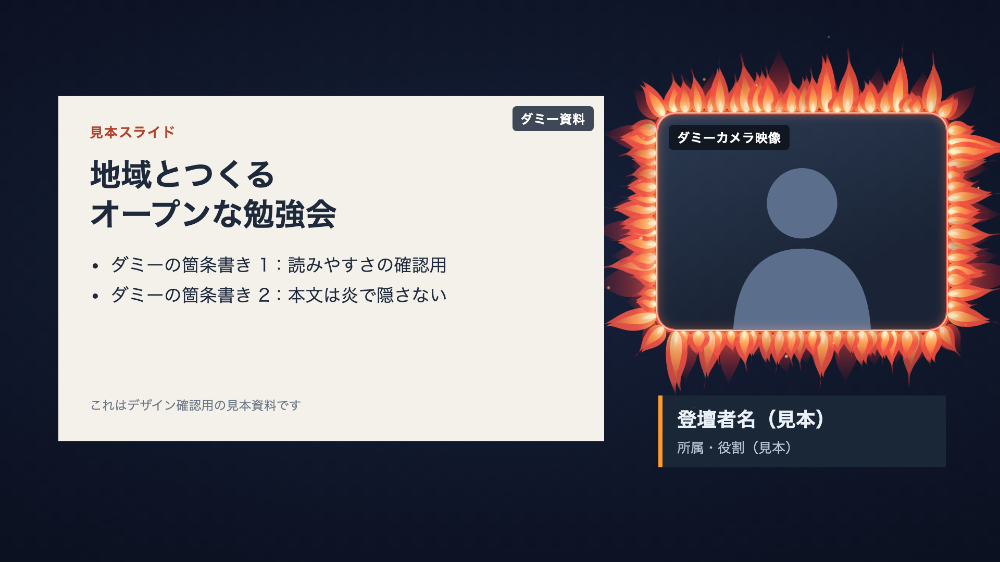
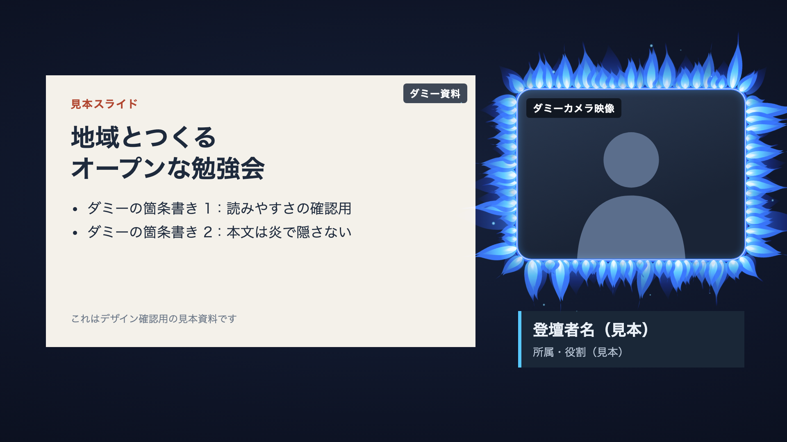
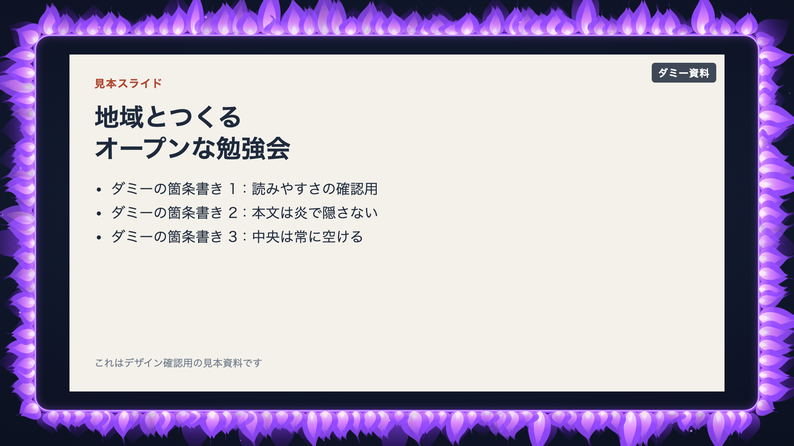
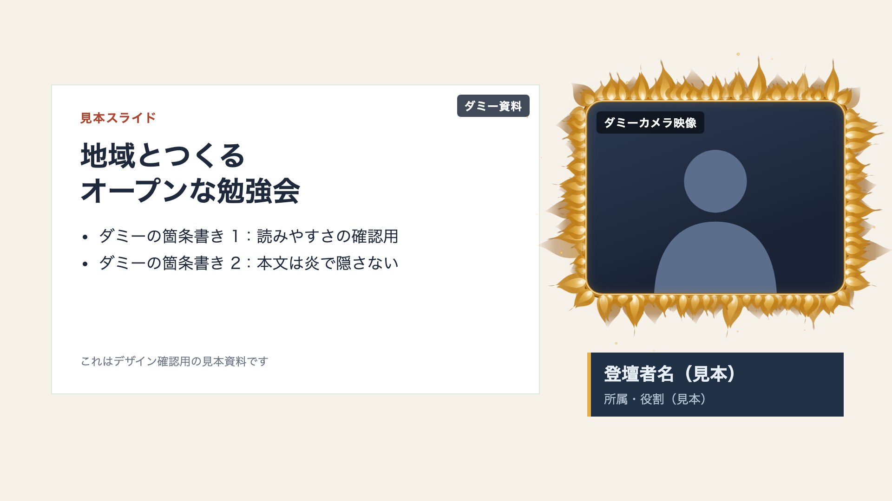
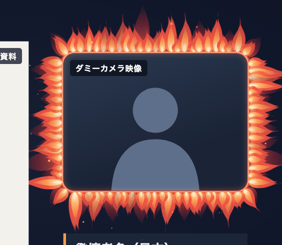

# 配信用「炎のフレーム」デザイン案 (#566)

配信画面のカメラ・資料・画面全体を炎で囲む装飾パーツ「炎のフレーム」のデザイン案です。
本書はデザイン提案であり、製品コードへの実装は含みません（オーナー確認後に別途実装します）。

- 試作: [`docs/assets/live-flame-frame-566/prototype.html`](assets/live-flame-frame-566/prototype.html)（DOM・CSS・SVG のみ。ブラウザで直接開けます）
- 掲載している画像はすべて試作の見本です。スライド・カメラ・氏名はダミーで、実イベント画面での動作を示すものではありません。

## パーツ名

- 表示名: 「炎のフレーム」

## 囲む場所

| 囲む場所 | 内容 |
| --- | --- |
| カメラ | カメラ枠の外周を炎で囲む |
| 資料 | スライド（資料）枠の外周を炎で囲む |
| 画面の縁 | 画面全体の縁取りとして四辺に炎を置く |

- 「中の人や資料が燃やされている」ではなく「**枠そのものが燃えている**」見え方にする。そのため炎は重力を無視し、枠から**外側へ放射状に**広がる。
  - 上辺は上へ、下辺は下へ、左辺は左へ、右辺は右へ、角は斜め外へ向く（角丸に沿って向きがなめらかに変わる）。
  - ゆらぎも外向きの向きに沿って動く（炎の先が外へ伸び縮みし、横方向にはわずかに揺れる）。火の粉も上へ昇るのではなく、枠から外へ離れていく。
- 枠の内側（カメラ映像・資料の本文）には炎を入れない。内側は枠に沿った控えめな光の線だけにする。
- 画面の縁では、画面の端から少し内側に枠の線を置き、炎はその線から**画面の端へ向かって外向きに**伸びる（画面の外へはみ出してよい）。中央の安全領域には届かない。
- 中央は常に空け、顔や本文を隠さない（試作の「安全領域を表示」で確認できる）。

## 色

| 色名 | 基調色 |
| --- | --- |
| 赤橙 | `#FF6A1F` |
| 青 | `#3A8DFF` |
| 紫 | `#A04BFF` |
| 白磁の金 | `#D9A441`（白磁の地に金の炎） |

既定は「赤橙」。

## 設定項目

| 項目 | 範囲 | 刻み | 既定値 |
| --- | --- | --- | --- |
| ゆらぎの強さ | 0–100 | 5 | 60 |
| 炎の高さ | 16–72 | 2 | 44 |
| フレームの太さ | 2–12 | 1 | 4 |
| 角丸 | 0–48 | 2 | 16 |

試作は URL パラメータ（`theme` / `place` / `flicker` / `height` / `thickness` / `radius` / `pause=1` / `motion=reduce` / `guide=1` / `view=output`）でも同じ状態を再現できます。炎の配置は固定シードで生成し、再読み込みしても同じ形になります。

## 動きの配慮

- **動きを減らす**: OS の「視差効果を減らす」（`prefers-reduced-motion: reduce`）または設定で、炎は静止した状態で表示し、火の粉も動かさない。
- **編集中のプレビュー**: 編集画面では一時停止でき、アニメーションを止めた状態で配置や色を確認できる。
- ゆらぎの強さを下げると揺れが小さく・遅くなる。

## 性能

- アニメーションは CSS の `transform` と `opacity` のみを使い、レイアウトの再計算を起こさない。
- 炎は SVG のパスとグラデーションで描き、画像ファイルや外部の通信を使わない（ネットワーク資源なし）。
- 炎の要素数は枠の周長から決まる一定数（試作では周長あたりの間隔で算出）に抑え、長時間表示しても負荷が増えないようにする。

## 実装の見立て（提案）

- 既存の配信セットの `LiveElement`（`type: "motif"`）の装飾モデルに、新しいモチーフ（例: `motif: "flameFrame"`）として追加する。
  - `packages/shared/src/liveSets.ts` のモチーフ種別 enum に 1 つ追加し、色・ゆらぎ・高さ・太さ・角丸を最小限の任意項目として足す。
  - 既存のモチーフ（lantern / halo / brackets / grid / ticks）や既存の配信セットはそのまま読み込めるよう、追加項目はすべて任意・既定値ありにする。
- 動きの許可範囲（装飾の動きのみ）と表示範囲の検証は既存の仕組みに合わせる。
- 描画は既存の配信画面・編集画面のモチーフ描画に 1 種類追加する形とし、動きを減らす設定と編集中の一時停止を尊重する。

## 見本画像

すべて試作 `prototype.html` の見本です（実イベント画面の証跡ではありません）。

赤橙・カメラ（1920×1080）

青・カメラ（1920×1080）

紫・画面の縁（1920×1080）

白磁の金・カメラ（1920×1080）

動きの見本（赤橙・カメラ周辺の切り出し）

## 対象外

- OBS など配信ソフトとの連携機能
- アラート（通知演出）との連動
- ラスター画像（PNG・GIF など）の炎素材
