# #562 配信セットのビジュアル設計 — 提案（実装・配備前）

## 目的と判断

現在の配信セットは基本要素と一系統の既定7シーンで実用になるが、「最初から配信として見栄えがする完成画面」と「自分のイベントへ手早く着せ替えられる装飾」が足りない。優先する成果は**画面そのものの品質**。配信先との接続方式や配信URLの変更はこの案件に含めない。これはオーナーによる見た目の合意用設計であり、下の画像は動く画面のスクリーンショットではない。実装着手・統合・配備は別の承認を要する。

| 系統 | 待機（16:9） | 講演（16:9） |
| --- | --- | --- |
| **灯り / Glow**：集い・トーク。夜空、琥珀の灯、柔らかい額縁。温かさは装飾へ、操作色はティールへ限定。 | 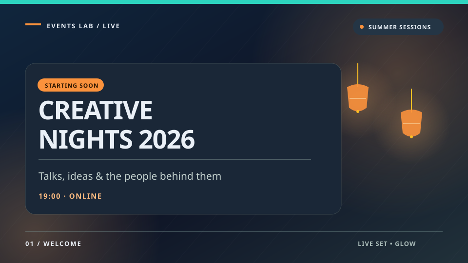 | 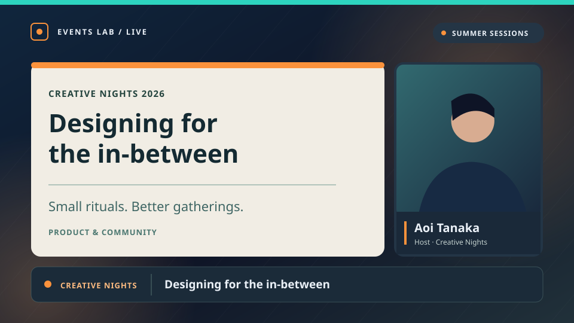 |
| **輪郭 / Signal**：コミュニティ・技術講演。細い罫線、冷たい夜空、明快なタイポグラフィ。情報を先に読む。講演は**左カメラ・右資料**で灯りと異なる。 | 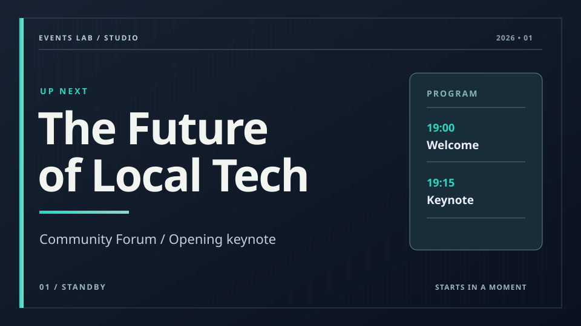 | 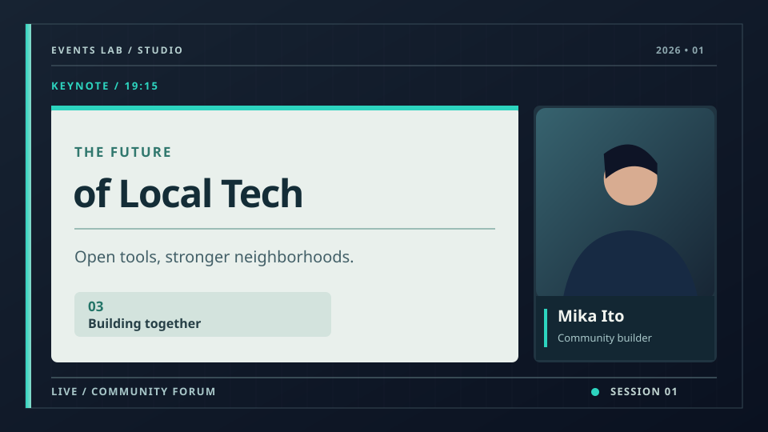 |

画像はすべてこの提案用に描いた**オリジナルのベクター説明図**（上の完成シーンは960×540）。人のシルエット、資料、イベント名、日時、角にある抽象的な**ロゴ見本**はダミーであり、実配信のスクリーンショットではない。静的 SVG をそのままアップロードできるという意味ではない（現行画像経路の許可 MIME とは別）。**従来**、時計/予定表/登壇者名/章番号/ON AIR は実データ未連携だった。本提案では現在時刻・カウントダウンと運営者が操作する LIVE 表示だけを新たな専用ランタイムとして追加し、チャット本文は接続した実メッセージから描く。予定表・登壇者名・章番号は依然として手入力の任意テキストで、自動状態を装う既定表示はしない。現行 `eventInfo` はタイトル・日時・参加者数・コミュニティのみ。Signal 待機の右カードは実際のイベントタイトル/日時を使う。

## 現状からの縦切り体験

- 現行: `/live-sets` から「新しい配信セット」で既定7シーンを複製するか、自分のセットを複製する。`/live-sets/:id/edit` で左のシーン一覧、中央のキャンバスと追加バー、右の要素設定を操作し自動保存。既定は待機・OP・スライド・スライド＋カメラ・カメラ・休憩・ED。イベントの配信コントロールで「デフォルト（ビルトイン）」または自分のセットを選び、シーンを切替え、別タブの完成画面をキャプチャする。現行の複製は**自分のセットだけ**。現行のエディタはカメラ/デッキ/イベント情報をプレースホルダーで表示し、配信画面は実データに置き換える。
- 提案入口: 一覧の「新しい配信セット」から**既定・灯り・輪郭・白磁**のビジュアルカード（待機＋講演のサムネイル）を選んで「このスタイルで作成」。既定カードは現在のシンプルな7シーンをそのまま残す。選択で新しい**自分の**セットを作成し、編集画面へ進む。既存セットの「このセットをベースに新規作成」は別の行動として残す。編集中のセットを別スタイルへ一括上書きしない。
- 編集: 最初から待機→オープニング→講演（スライド＋カメラ）→全画面資料→全画面カメラ→休憩→エンディングの流れが揃う。「部品を追加」から家族ごとの**完成部品カード**（下のシート）を一つ選び、その場で複数の通常要素を挿入する。登壇者名・章タイトルの見本文字を直し、必要なら色・線・モチーフ・枠/カメラ位置を個別編集する。挿入後は最初の主テキストを選択、続く編集はキャンバスで各要素を選択し右欄で変更する。『挿入カード』は操作の単位であって保存後のグループではない。各要素は独立に移動/複製/削除できる。色変更の影響は選択要素へ明示し、セット全体の色変更と混同しない。ドラッグ・整列の目安は16:9の安全領域で表示するが配信には出ない。自動保存の失敗は成功表示に化けず、再試行と未保存状態が分かる。既存の Undo/Redo・シーン複製・前後移動・要素の前後関係を維持する。
- リハーサル: 編集画面のカメラ・資料・イベント情報は引き続き**見本**と明示。実データは既存のイベント側コントロールで自分のセットを選択し、別タブの完成画面を確認する。配信中の編集反映は現行のポーリングに従い、反映タイミングを UI に説明する。スマホではリスト→プレビュー→設定を縦積みにし、配信画面そのものは16:9のまま縮小表示する。

**表示言語**: 画面・部品の名称、設定、状態、エラー文言はまず日本語で読めるようにし、既存の多言語辞書と同じ経路で英語などへ切り替えられるようにする。デザイン図の見本文章は翻訳された固定データではなく、実画面に流す文字は利用者が入力した内容または実イベント情報を使う。

## 視覚ルール（960×540 論理座標、出力16:9）

- **灯り**: 背景 `#0E1426`、面 `#1A2737`、本文 `#EAF0F7`、灯り `#FB923C`、操作の目印 `#2DD4BF`。一画面で橙は装飾・進行表示、ティールは操作・小さな強調に使い分ける。小提灯・柔らかい拡散光・細い対角線は端に寄せ、文字の背後を騒がせない。見出し 48–56、情報帯 18–22、補助 16px 以上を実出力の基準とする。細かいモックの識別子は放送必須情報にしない。
- **輪郭**: 背景 `#0A1120`、線 `#607C83`、大きな見出し `#F1F4EF`、強調 `#2DD4BF`、読み物パネル `#E9F0EC`＋濃色文字。太い余白・薄い方眼・非対称のパネルで整理し、ランタンや琥珀を混ぜない。待機はイベント名を主役に、講演は資料領域を主役に。イベントの運営画面は DESIGN.md の夜祭トーンを守り、配信シーンはその延長線上の**表現違い**とする。
- 書体は Plus Jakarta Sans（英数字）＋ Noto Sans JP（日本語）を候補とする。**現在 Plus Jakarta Sans は編集フォント選択肢にない**ため、実装時に共通フォント選択肢へ追加して編集/サムネイル/本番で同じ読み込み経路を使い、未ロード時は Noto Sans JP→sans-serif へ落とす。待機中に代替字幅で完成画面が撮られないよう、必要フォントの読み込み完了後のプレビュー/配信キャプチャで比較する。外部フォント不達でも読める代替を用意し、第三者の画像で代用しない。タイトル2行まで目安、長い日本語イベント名や登壇者名は実データで折返し・省略・改行案内を行い、隠れた全文は編集欄で確認できる。時計やイベント情報は文字列長が変わるためモックの行数を保証しない。名前帯にイベントタイトル全文を自動流入させない。
- 外周32px、情報枠に内側24–30px、主要コンテンツ間16px以上。配信テキストは端から原則48px以上、重要な顔・資料本文は約 x=64..896 / y=54..486 に収める。待機画面は上段に企画名、中央に主見出し、下段に実際のイベント日時。灯りの講演は**左の広い資料＋右の登壇者**、輪郭は**左の登壇者＋右の広い資料**で異なる視線誘導を作る。カメラの上へ資料の文字を重ねない。1枚のスクリーンショットを重ねるのではなく、資料・カメラ・動的文字・装飾を別部品にする。
- **動きは価値の中心**: 静止画を揺らすのではなく、下記の型付き marquee/rotation/colorCycle と実時計・カウントダウンを別要素として実行する。常時点滅/強いパララックス/紙吹雪は採用しない。従来のシーン切替400msフェードは別扱い。低モーション設定では装飾アニメーションを止めても時間情報は更新する。小サイズのサムネイルは静止していても色とレイアウトで判別可能にする。

## 完成部品カタログ（両家族とも一枚ずつ個別挿入）

| 灯り：4つの装着例（部品シート） | 輪郭：4つの装着例（部品シート） |
| --- | --- |
| 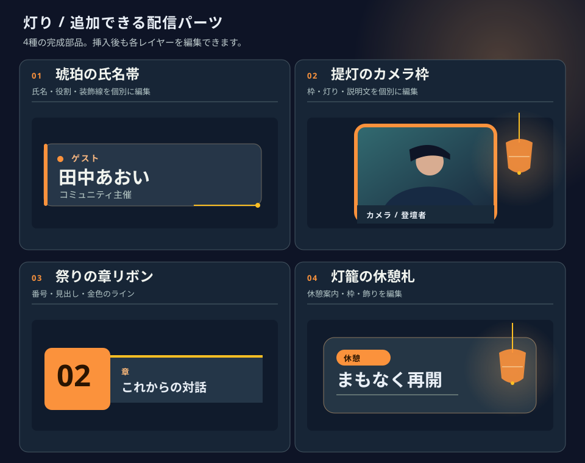 | 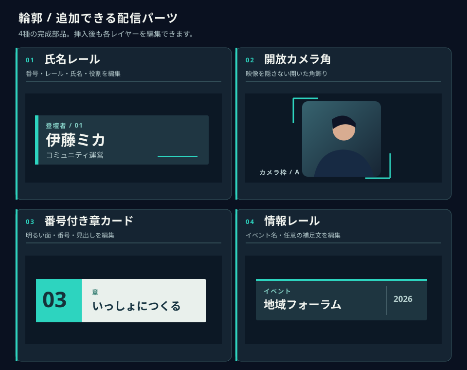 |

**カタログの各カードは1回の挿入操作で完成した複数レイヤーを作り、個別に編集・削除できる（新しい保存グループ/リンク編集は不要）。** カードごとの構成は以下。モック上の人型/文字/ロゴは見本であり、完成部品に人物写真や偽の放送状態は含めない。色は家族の初期パレット、各レイヤーを選択したときの値を示す。

| 家族・挿入カード | 通常要素への展開（例） | 編集導線・使いどころ |
| --- | --- | --- |
| 灯り「琥珀の氏名帯」 | 角丸面＋左の橙レール＋小灯＋氏名/役割テキスト＋細い金ライン（6要素） | 氏名・役割を個別入力、面/線をそれぞれ再配色。講演・インタビューのカメラ下に置く。 |
| 灯り「提灯カメラ額」 | camera＋暖色の枠面（映像より背面）＋端の小提灯 motif＋任意キャプション（4要素） | 枠と映像は別に移動・調整しやすい位置に初期配置。装飾だけを削除しても映像は残る。 |
| 灯り「祭り章リボン」 | 数字/短いラベル/章タイトルの text＋橙と濃紺の面＋金ライン（6要素） | 章番号は**手入力**で自動進行しない。番号を削って文字だけでも使える。OPと幕間に挿入。 |
| 灯り「灯籠の休憩札」 | 枠面＋見出し/任意の次の案内 text＋提灯 motif＋小さな色チップ（5要素） | 待機・休憩・EDの余白に置く。再開時刻を初期表示せず、実際の案内だけ手入力。 |
| 輪郭「氏名レール」 | 濃色面＋縦ティールレール＋任意インデックス/氏名/役割 text＋細線（6要素） | インデックスは**手入力**、空なら省略。広めのカメラ下、対談にも使う。 |
| 輪郭「開放カメラ角」 | camera＋左上/右下の2つの角 motif＋任意の短いキャプション（4要素） | 角を動かす/消す操作で視認領域が変わる。映像に太いベゼルをかぶせない。 |
| 輪郭「番号付き章カード」 | 明色面＋番号面＋短い番号/章タイトル/種別 text（5要素） | 手入力の章番号を使わない場合は番号面と文字を個別削除。待機から講演への区切り。 |
| 輪郭「情報レール」 | 濃色面＋ティール線＋動的イベントタイトル＋任意の副文 text＋区切り線（5要素） | タイトルは `eventInfo.title`。副文は未入力で非表示（年・時刻・配信状態を勝手に補わない）。待機、全画面資料の隅に。 |

カメラを含むカードは既存 `camera` のフィット/角丸に従う。部品を個別に挿入した結果が各シーン50要素を超える場合は事前に追加を止めて理由を表示する。プリセット挿入の Undo は1回で全追加を元に戻せるようにし、既存の複製/前後移動/削除はレイヤー単位。操作の入口は「部品を追加 → 家族別サムネイル → 挿入 → キャンバスで部品レイヤーを選択 → 右欄で内容・色・位置を編集」。他家族の部品も個別選択可能だが、最初のテンプレートだけ家族で絞る。

**ロゴ**: 完成フレームの左上に見える抽象マークは**任意画像枠の位置を示す見本**であり、ブランド画像を自動提供しない。灯りは左上 x=52..80、輪郭は左上 x=64..89 の小さな枠、対応するイベント名/文字見出しはその右。画像を挿入した人だけロゴを表示し、未設定なら枠を出さず文字を左端へ寄せる。アップロードは既存画像経路、アスペクト比は contain、容量/背景違いでもロゴが主役の文字を隠さない。ロゴの有無・差替えはシーン間で実際に目視確認する。

## 動く完成部品 — 設定可能な効果と本当の時刻

| 灯り：琥珀の回転飾り・流れる案内・時計/カウントダウン | 輪郭：インデックスの回転・ティールの色循環・時計/カウントダウン |
| --- | --- |
| 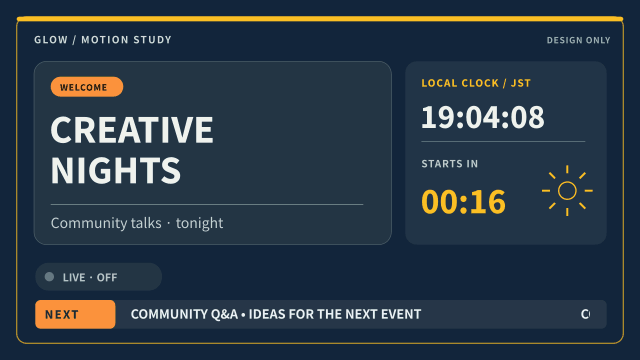 | 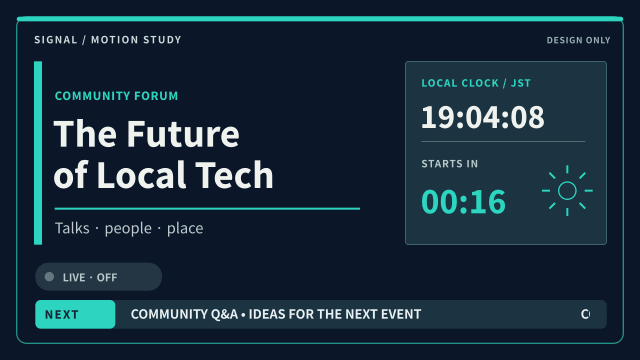 |

この GIF は**本書だけの16フレームの動く設計プレビュー**。表示の `19:04:08` などは見本値、「LIVE · OFF」は操作状態の説明ラベルであり本番のバッジではない。実出力では OFF 時に LIVE の文字・点・バッジを一切表示せず、ON 時だけ表示する。**実装で GIF を再生して時計やアニメに代えることは禁止**。本番画面は React/DOM のライブデータ＋CSS transform/gradient と実時刻計算で更新する。静止画の一部が周期再生されるだけでは受入不可。演出は資料/人物の外周に、同時稼働は最大2装飾＋時間ウィジェットに抑え、文字の背景コントラストを保つ。

| 新しい部品（両家族共通の型、外見は別） | エディタの設定・初期値 | 実出力・失敗時 |
| --- | --- | --- |
| **流れる案内** `marquee` | 手入力文言（最大120字）、方向=左、1周12–40秒（初期20秒）、隙間24–64px、色/背景、停止ボタン。灯りは下段の温色帯、輪郭は細い情報レール。 | 実 DOM テキストを2回並べ、幅を計測して切れ目を見せず等速横移動。短文でも帯全体が切れないよう繰返し距離を計算。空文は表示しない。文字を再編集したら幅再計測。利用者入力の HTML/リンクは実行しない。 |
| **回転装飾** `motif.motion.rotation` | モチーフID（灯りの小灯/光輪、輪郭の同心目盛）、方向、12–60秒/周（初期30）、色・大きさ・位置。 | CSS transform の回転のみ。文字/カメラ/資料/ロゴは回さない。装飾は主役の安全領域外へ置く。 |
| **色の循環** `shape/motif.motion.colorCycle` | 家族別2–4色パレット、8–30秒周期（初期18）、停止色・対象=装飾だけ。各色と隣接文字のコントラストを編集時に確認。 | CSS の色/不透明度を連続補間、閃光や急激な白黒切替を使わない。文字・背景の可読性が落ちる設定は拒否。無効なパレットは安全な単色。 |
| **現在時刻** `clock` | IANA タイムゾーン（初期候補 `Asia/Tokyo` を**明示表示して選択**。イベント日時に timezone が保存されていると仮定しない）、時刻24h/12h、秒の有無、任意の日付行、家族別額縁/色/文字サイズ。 | `Date.now()` を選択 timezone で `Intl.DateTimeFormat` に通す。時刻は毎秒、秒なしなら分境界で再計算。日付またぎ・夏時間もフォーマッタに任せる。端末時計が不正確な場合は両表示に差が出るため実機で時刻同期を確認し、配信を「公式時刻」とは呼ばない。 |
| **カウントダウン** `countdown` | 対象=`eventStart` または入力したローカル日時＋選択した IANA timezone から確定した UTC ISO 時刻（保存はepoch ms）、時/分/秒、ゼロ後=`00:00で停止` / `隠す`（初期停止）、家族別の表示。未確定日程は手動日時入力を促す。夏時間の存在しない時刻は拒否、重複時刻はオフセットを選択させる。 | `max(0, ceil((targetEpochMs − Date.now())/1000))` から毎秒再計算し、タブがバックグラウンドで遅れても累積タイマーに依存しない。ゼロ到達は LIVE を自動点灯せず、音やカメラ切替も起こさない。未設定/無効値は本番では非表示、編集で警告。 |
| **LIVE バッジ** `liveIndicator` | 色・配置・表示文言（既定 LIVE）・手動 ON/OFF。初期 OFF。配置は灯り=右上の琥珀、輪郭=左上のティール縦線と合わせる。 | ON/OFF は**イベントごと**の運営者宣言であり外部配信状態検出ではない。OFF 中はどのシーンにも表示しない。配信開始前にコントロールから ON、終了後 OFF。状態不明時は OFF 扱い。自動で点滅はしない。 |

設定保存は `LiveElement` に追加する**閉じた判別可能な型**（例 `marquee`/`clock`/`countdown`/`liveIndicator`、既存 `motif`/`shape` の任意 `motion` 列挙）とする。秒数・色数・文言・位置・IANA timezone を schema で制限し、任意 CSS キーフレーム、HTML、JS、式文字列、外部フィード URL を保存/実行しない。モーションを使うパーツの初期セット例: 灯り「巡る案内帯」「灯りの時計」「祭りの開始カウント」、輪郭「流れるレール」「目盛の時計」「開演カウント」。既存部品も右欄から対応する装飾効果を付けられる（文字/映像/ロゴには rotation/colorCycle を適用しない）。未指定 motion の昔のセットは静止のまま、ビルトイン既定も変更しない。

エディタは主キャンバスに**再生/一時停止**、時刻プレビューは「見本」と実時刻の切替を明示し、本番画面と同じ要素レンダラーへプレビュー用時刻/状態を注入する。プレビューは LIVE の実イベント状態を勝手に ON にしない。静止サムネイルは時間値を見本と注記。実出力では時刻の1秒境界へ `setTimeout` を再設定して `Date.now()` から計算し、タブ復帰/時計変更/シーン復帰に即時再計算。`visibilitychange`/時計の飛びを扱い、CSS animation も必要なら再開・フェーズ再同期する。`prefers-reduced-motion`、エディタの停止、機器負荷時は marquee を全文静止/省略ではなく読める冒頭で停止、回転と色循環は安全色の静止にし、**時刻とカウントダウンの数値だけは更新**する。時計が破損したときは偽時刻を出さず非表示＋配信者向け警告。細い装飾が1080pで目立っても720pとスマホ縮小プレビューで文字が最優先。

**LIVE の権限・同期**: `event_live_state` への `liveIndicatorOn:boolean`（DB既定 false）を提案し、イベントIDで GET と PATCH。既存の read–merge–全列 UPDATE を拡張時に改め、PATCH で明示された列だけを原子的に更新する（または同等の直列化・バージョン競合検出）。シーン切替、LIVE ON/OFF、コメント元切替が別タブから同時に送られても互いを巻き戻さず、特にコメント OFF を古い列値で復活させない。現行 `GET/PATCH /api/events/:id/live-state` は `requireEventRole(["staff"])`、画面は約1秒ポーリング。新しいスイッチは**当該イベントの参加確定 staff**のみ更新可（admin バイパスの可能性を含め既存の guard だけに依存せず明示チェック）、CSRF/既存認証を継承。UI はコントロールに「配信中表示（手動） OFF/ON」と更新日時・最後の保存結果を表示し、二重タブではサーバ最終値を正とする。PATCH失敗時は実画面を ON にしたように見せず再試行、画面で GET 失敗/古い値なら badge を隠し状態取得失敗を運営側へ通知（瞬断で古い ON を無期限表示しない）。タブ再起動後も DB 値を再読込、別イベント/別セットの値を流用しない。イベント終了時に古い ON が残り得るので、終了後は表示を停止し運営画面で OFF に戻す操作を促す。プラットフォーム側の配信中かどうかの判定を約束しない。

## イベントコメントを流す部品 — 実メッセージだけ

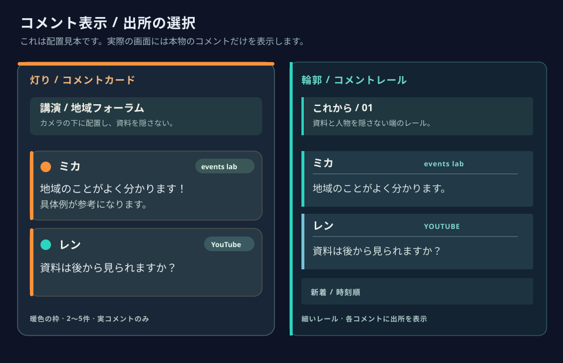

シートは**架空の匿名コメントを使った配置見本**（実データのスクリーンショットではない）。家族ごとに1つの「コメント」カードを部品一覧に追加し、配信セットのシーンに `chat` 要素（x/y/w/h、家族見た目、行数2–5、表示秒数10–45）を挿入。灯り=暖色見出しの半透明カード、輪郭=ティールの左罫と省スペースのメッセージレール。ソース名は**各コメントに必ず表示**、両家族とも顔・資料本文・既存の氏名帯を覆わない初期位置で、チャットを消してもシーンが成立する。氏名/本文は折返し2行まで、長文省略、画像/リンク/HTML/リッチイベントは含めない。表示は直近の実投稿のみ、投稿がないときは透明（編集時だけ「見本コメント」）。

- **配信者の入口（#562）**: セットでコメント部品を挿入→イベントの配信コントロールで「表示しない / events lab」を選択→自分の配信画面で出所ラベルと実コメントをリハーサル確認。YouTube 接続・合流は #564 のみ。ソース設定は**イベント単位**で staff が変更し、シーン側にはレイアウトだけを保存。既定は `off`（部品を挿入しただけでは参加者の発言を本番に出さない）。切替時は以前の表示バッファを消去し、新ソースを再接続。両方を選べても接続できていないソースは明示して運営者へ通知、スクリーン側では虚偽の「接続済み」「新着」を出さない。
- **イベント単位の設定/API**: #562 では `event_live_state` に `chatSource: "off" | "event"`（既定 `off`）だけを追加し、LIVE フラグと同様 GET/PATCH `/api/events/:id/live-state` から現在モードを配る。#564 で検証済みの場合のみ `youtube`/`combined` を追加する。YouTube の接続/解除と候補一覧は新しい**イベント限定 staff 専用**の開始・OAuth コールバック・候補選択・切断 API とし、コールバックの署名済み `state`/一回限り nonce/ログインセッション/当該イベントの参加確定 staff を照合する。選んだ `liveChatId` はイベントと紐付けサーバで保持、YouTube 本文は同イベント限定の認証付き短期フィード GET を通す。イベントチャット本文はサーバで代理収集せず既存のブラウザリレー口、画面側で正規化して混ぜる。#562 では `youtube`/`combined` への PATCH を拒否する。#564 で追加する場合は当該イベントの接続検証完了後のみ受け付ける。接続解除時は該当ソースの表示バッファも消す。配信画面は最新の GET が成功し、最終成功から5秒以内のイベント単位 `chatSource` だけを有効とする。GET 失敗・5秒超の滞留・認可失効時は前回の ON 値を使わず購読/取得を止め、全ソースの表示バッファを消し、コメント部品を非表示にして運営画面へ接続状態エラーを示す。回復後も再認可・再取得した新しい状態からのみ再開する。新しい public feed API は設けない。
- **events lab**: 既存のブラウザ→リレー直接購読を再利用する別の**閲覧専用**データ口。イベントが public / 公開済み / 日程確定 / chatEnabled、ログイン中の確定メンバーでブロックされていないこと、`chat-members` のチャンネル・許可鍵・hidden ID を取得できることを出力前に確認。配信画面が staff 専用でもイベントチャット権限を暗黙付与しない。既存 `EventChat` の display variant / `useEventChatAccess` / `useChatChannel` / `selectVisibleChatMessages` の判定に沿うが、チャット用の読み取り専用一時接続は送信/部屋作成不可。メタデータは現行5秒ポーリング、非表示・ブロック・チャンネル再作成・権限失効を**次の取得時点で**既表示から除外/消去し、権限失効では購読も切る（最大でポーリング遅延があると運営者に明示）。**暗号化 staff chat や非公開イベントの本文は取り込まない**。サーバに本文一覧があるわけではないので、既存 API から任意イベントのログを取得できるとは設計しない。
- **YouTube**: 既存 Google ログインの `openid email profile` と動画埋込は YouTube ライブチャットの接続ではない。別の同意とイベント紐付けが必要。提案する安全な確定経路はスタッフが**自分のライブ放送を読取専用で接続**し、サーバ側が `liveBroadcasts.list(part=snippet, broadcastStatus=active)` の `snippet.liveChatId` を検出すること。公式にこの放送一覧は OAuth 認可が必要で `youtube.readonly` 等を許可（下の出典）。スタッフは候補を選択してイベントへ紐付け、接続確認でのみ `youtube`/`combined` を有効にする。既存ログインの認証トークンを流用しない。OAuth の scope と `liveChatMessages.list` 読取権限は**資料に明示保証がない**ため、実装前に実際の有効な放送で接続/権限を検証し、必要なら設計とオーナー承認へ戻す。API-key-only、任意の動画 URL からの無認可読取、streamList の Workers 動作はいずれも前提にしない。
- **取得契約**: バックエンドが YouTube に `liveChatMessages.list(liveChatId, part=id,snippet,authorDetails)` を送り、`nextPageToken` を保持、返る `pollingIntervalMillis` より早く再呼出ししない。最初の接続は最近の履歴だけ（古い全件取得は約束しない）。複数の出力/プレビュータブはイベント＋連携放送IDごとの1共有カーソルと次回取得許可時刻、短期の上限付きキャッシュを共有し、同時要求が upstream を二重に叩かないようイベント単位の排他/リースを検証して実装する。認可失敗や rateLimitExceeded で間隔を伸ばし運営者へ接続状態を返す。外部 OAuth トークンはサーバー限定で暗号化保存・失効/切断で破棄し、ブラウザ・配信セット・ログへ渡さない。接続先 `liveChatId` とイベントの対応は staff のみ操作、表示取得もイベントの参加確定 staff と当該紐付けに制限する。永続的なチャット本文保存/再配信アーカイブは作らない。権限のある別イベントから同じ接続を黙って使い回さない。
- **表示/時系列**: 共通表示型は `{source: "event" | "youtube", id, authoredAtMs, receivedAtMs, author, plainText}`。event は Nostr `created_at` 秒をmsへ、YouTube は `snippet.publishedAt`、UTC エポックに変換。各ソース内 ID＋ソースで重複除去、同時刻は `source`→`id` の固定順。公開条件/投稿者の許可/非表示/最大長を**合流前**に適用し、**受信後**直近60秒かつ最大100件のバッファを投稿時刻昇順にして最後の2–5件を表示。遅れて届いた投稿も受信後の範囲内では元の投稿時刻位置へ挿入し、既表示最古より古いものはリプレイしない（接続時の履歴洪水防止）。取得間隔で新着が落ち得る場合は運営へ遅延を示し、混在表示を完全な全履歴と呼ばない。年時刻の異常値/未来すぎる時計は落とし、ソースごとに未接続/遅延/終了/権限拒否を運営画面に示す。片方が落ちた場合は残るソースだけ続行し、過去の不可視メッセージを表示し続けない。YouTube の削除 tombstone を受けて対象が識別できる場合は除去するが、公式文書は削除時に tombstone が必ず送られるとは保証しないため**削除通知の即時性は保証されない**。`snippet.type === "textMessageEvent"` かつ `hasDisplayContent` のあるテキスト投稿のみ採用、寄付/スタンプ/会員イベント等のリッチコンテンツは表示しない。YouTube 個人アイコンは #564 で著者画像の利用規約・安全性・帰属の検証後に扱いを決め、#562 では接続も画像取得も行わない。受信を停止/再開しても UI は作り物のコメントに置き換えない。
- **画面の安全**: 発言は DOM のテキストノードで表示し Markdown/HTML は解釈しない。URL の自動リンク、外部画像、埋込、任意 CSS/JS は禁止。行数/文字数/描画間隔に上限を付け、表示名も制限。YouTube 出所は各行で見分け、公開に際し公式ブランド表示ポリシーに沿った Brand Features を使用（本シートの文字ラベルは本番ブランド表現の代用ではない）。利用規約に適合する保管・削除方針を実装時に確認し、キャッシュは短命で漏出を防ぐ。

**公式資料と現行コードの根拠（確認済みと未確認を分離）**: `apps/server/src/routes/liveControl.ts` と `packages/shared/src/liveSets.ts` はイベント状態の staff GET/PATCH と1秒画面ポーリング、`apps/web/src/pages/LiveScreenPage.tsx` は描画入口。`apps/server/src/routes/eventChat.ts`, `apps/web/src/lib/useEventChatAccess.ts`, `apps/web/src/components/EventChat.tsx`, `apps/web/src/components/chat/useChatChannel.ts`, `apps/web/src/lib/chatMessageBuffer.ts` は第一者の閲覧/非表示境界。OAuth ログインの現行スコープは `apps/server/src/auth/providers.ts` を参照。[liveBroadcasts.list](https://developers.google.com/youtube/v3/live/docs/liveBroadcasts/list) は OAuth の必要性と許容 read-only scope、[liveBroadcast.snippet.liveChatId](https://developers.google.com/youtube/v3/live/docs/liveBroadcasts#snippet.liveChatId) は放送との接続、[liveChatMessages.list](https://developers.google.com/youtube/v3/live/docs/liveChatMessages/list) は `part`/カーソル/`pollingIntervalMillis`/終了・レートエラーを記載。[liveChatMessage resource](https://developers.google.com/youtube/v3/live/docs/liveChatMessages) は `publishedAt`/種別/tombstone の制約。[streamList](https://developers.google.com/youtube/v3/live/docs/liveChatMessages/streamList) は公式には効率的だが実行環境互換性・料金は未検証。[quota cost table](https://developers.google.com/youtube/v3/determine_quota_cost) は list と broadcasts.list が各1単位と記載、streamList コストは未確認。[Developer Policies](https://developers.google.com/youtube/terms/developer-policies) の Branding とデータ表示/保管条項を正式配備前に確認する。公式公開文書を読むだけでは **chat list の OAuth scope や接続動作/クォータの実環境確認はできていない**。これらを動く YouTube ソース機能の実装承認前ゲートとする。

**段階ゲート（オーナー承認 2026-09-27）**: 初期リリースは動く画面・編集できる部品・実際の events lab チャット表示までを #562 で完成させる。YouTube 接続と二ソース時系列統合は [#564](https://github.com/428lab/events/issues/564) へ分割し、実ライブで認可・接続が検証できてから追加する。同じ最終体験として UI に3つの選択肢を示すのは**両実ソースが動作・認可・帰属表示を満たした時だけ**。初期 UI は「表示しない／events lab」のみとし、YouTube/両方を架空のサンプルや常に失敗する選択肢として公開しない。外部読取の検証が失敗した場合は代替（追加スコープ/対象の縮小など）を設計へ戻して承認を得る。動画の埋込や配信URLの変更は本件の代替にしない。

## 七つのシーンを「完成セット」にする処理

| シーン | 灯り / Glow | 輪郭 / Signal |
| --- | --- | --- |
| 待機 | モックの夜空・灯り2点＋左の大きなタイトルカード＋**実際の**イベント日時。時計/カウントダウン/流れる案内を安全余白へ個別追加できる。空のロゴ枠は非表示。 | モックの大きなイベント名＋右の動的タイトル/日時カード。時計と流れる細線レールを加えられる。任意の番組表は**初期では出さない**。 |
| OP | 暖色グラデの幕開け、大きなイベント名、下端の細い灯りライン/モチーフ。架空の開始カウントなし。 | 左レールを伸ばしたタイトルパネル、右に短い装飾線と動的イベント名/日時。章インデックスの架空数値なし。 |
| 講演 | 左の明るい資料面＋右カメラ、琥珀の氏名帯、下端にイベント名/任意の講演題。 | **左のカメラ＋右の明色資料面**、氏名レール、細い下部情報帯。両者は反転だけではなく面積比・角処理・配色を変える。 |
| 全画面資料 | 余計な情報を差し込まず deck を大きく表示。灯りの上下細線と任意の小イベントラベルは資料にかぶせない。 | deck を大きく表示し、細い周辺罫線と小さいイベント名レール。映像の縁の安全余白を守る。 |
| 全画面カメラ | camera 主体、名前帯と端の1灯だけ、顔には模様を置かない。 | camera 主体、開放角フレーム＋氏名レール。映像がないときは既存の未許可表示。 |
| 休憩 | 灯籠の休憩札＋低コントラストの夜空、再開時刻は手入力した場合のみ表示。設定した再開目標へのカウントダウンは時計と別の時間部品。 | 薄い格子の背景＋余白を取った『休憩中』カード、次の案内は任意入力。回転目盛と設定済みカウントダウンを選べる。自動の進行状態なし。 |
| ED | 同じ灯りを減らした静かな夜空、イベント名と御礼、下端の光ライン。 | 左レールを閉じる終幕パネル、イベント名と御礼、背景の方眼を控えめに。 |

各スタイル7枚を新規セットへ複製する。シーンの削除・複製・順序変更は既存どおり。BGM は既存の「維持/停止/選択」を継承し、テンプレートはライセンス未確定の曲を自動再生しない。

**必要な実装境界（提案、未実装）**: `LiveSetContent` は現在 `text/image/camera/deck/eventInfo`、要素上限50・シーン上限50。配信画面は `LiveSceneStage`、編集キャンバスは `LiveElementContent` を共有する。実装時は `shape`（矩形/円/線、塗り/枠線/角丸/不透明度）と `motif`（安全な定義済み形状ID: 小提灯/角ブラケット/方眼など、色/不透明度）を要素の追加候補とする。**部品カードのデータはこの通常要素の並びと初期配置**であり、挿入時に一意のIDを割り振り、選択した各レイヤーを保存して同じルールで拡縮する。テキスト・画像・映像を大きな画像1枚に焼き込む方式は**非採用**（編集不能・実データ欠落）。新種とテンプレの静的データは shared の schema と web の編集/描画・要素欄で対応し、固定テンプレは版付きの同梱定義として作成時だけ展開、既存のセットに後から見た目を注入しない。情報帯は shape + text の組合せとし、不要な保存グループ編集システムは増やさない。初期シーンと挿入先は各50要素以内で確認する。

**画像と権利**: 追加の見本アートは自作の SVG 原画から、配信で使う同梱 raster (透過 PNG/WebP) へ変換し、UI 上でプリセットとして挿入するなら同一オリジン URL を保持する。既存の利用者アップロードは許可形式・6MB 上限・所有者チェックの画像ルートを使う。ユーザー任意画像の著作権はユーザーに確認を促すが、外部素材を既定セットへ同梱しない。画像URLを編集できる既存機能を拡張して外部スクリプト・HTMLを実行させない。SVG の任意アップロード許可はこの設計に含めない。静的な提案 SVG はプロダクトに埋め込むスクリプトではない。

## API・認可・互換性

- 新規作成のみ `POST /api/live-sets` に任意 `templateId: "glow" | "signal" | "hakuji"` を追加する案。`templateId` なし＝現行既定、`baseLiveSetId` と同時指定は拒否する。サーバー固定リスト以外を拒否し、クライアントが任意 content を「組込テンプレ」と称して送れないようにする。既存の複製は所有者チェックを維持。`GET /mine`, `GET /:id`, `PATCH /:id` の認証・オーナー判定を変えず、イベントへのセット選択・既定 ID・配信画面の staff 取得権限も変更しない。**追加の LIVE スイッチと外部チャット連携管理には上の専用権限・イベント単位の状態を加える**。配信URL新設や公開テンプレ共有 API は不要。
- 既存 JSON に新要素を追加する前方互換の拡張とする。昔のセットと仮想既定7シーンは**自動変更しない**。既存要素の座標、BGM の undefined/null/trackId、配信の activeSceneId を維持する。新しいセットは作成時に固定 ID としてコピーし、編集や複製で ID 重複・画像 URL の他人のセットへの参照が生じないように扱う（所有権がある元セットのみ複製可。ユーザーアップロード画像を複製する時の実体参照・削除方針を実装前に検証）。古いブラウザタブで新要素を含む content を再保存すると未知フィールドを落とす可能性があるので、実装時は旧クライアントの編集停止/リロード通知等で保護してからリリースする。セット content JSON だけなら migration 不要かコードで判断するが、**イベント LIVE 状態の boolean と接続先/保管する資格情報には新たな保存スキーマが必要**。初期 false/off と既存イベントの読み出し互換を migration 前に決め、元の運営権限を越える公開ルートは追加しない。
- プレビューと本番は**同じシーン要素レンダラー**が必須。現行エディタは独自配置、サムネイル/配信は `LiveSceneStage` なので、新要素の描画・重ね順・折返し・拡縮を三者で揃える。見本イベントデータと実イベントデータ、プレビュー時計と実時計、空の見本チャットと実チャットの差、未許可カメラ、未選択資料、画像未取得を明示する。ポーリングによる更新の見え方は収録前の実機確認で検証する。

## 受け入れ（後続実装の合格条件）

1. 新規作成で4カードの違いが小さいサムネイルでも判別でき、「灯り」「輪郭」「白磁」を選ぶと**各7シーンが編集可能な自分のセット**として作成される。無選択の従来作成と他人所有セットの複製拒否は変わらない。
2. 待機と講演に加えて**OP・全画面資料・全画面カメラ・休憩・ED**を両家族とも実画面でキャプチャし、上の7シーン表の処理と照合する。各シーンを実際に1080p/720p、PCの960×540プレビュー、縮小したスマホプレビューで比較し、重要なタイトルと登壇者帯が切れず、顔と資料の重なりがなく、文字が映像上で読めること。全画面資料は資料本文を装飾が隠さないこと。長い日本語タイトル・英語タイトル・未登録/差替え済みロゴ・カメラ拒否・資料未選択・フォント読み込み失敗も確認する。見本の人物画を実人物が表示されると誤認させない。
3. 両家族の**4つずつの完成部品を一つずつ挿入**し、見本文字と色/線を変更、カメラ枠の装飾だけを削除、異なるシーンへ再挿入、Undo→Redo、保存→再読込→配信画面へ反映することを確認する。挿入された各レイヤーが個別選択・移動・複製・削除でき、何が編集できるか分かる。単純なフラット画像1枚では不可。50要素を超える場合は黙って切り捨てない。
4. 編集のサムネイルと本番が同じ重ね順・書体・色・角丸・画像を示し、イベントタイトル/日付/カメラ/スライドと新しい実時計・残秒だけが意図した実データに入れ替わる。**予定がモックと違うイベント**で、架空の番組表・章番号・自動 ON AIR の生成が無いこと、LIVE は運営操作が ON のときだけ表示されることを確認する。旧セット/ビルトイン既定の再読込・シーン切替・BGMは回帰しない。
5. 権限のないユーザーが他人のテンプレ元・セット内容・画像登録へアクセスできない。古い編集タブで新要素が失われないことと、アップロード画像を持つセットの複製/削除の結果を確認する。
6. GIF ではなく実画面で marquee が途切れず流れ、装飾が回り、色が制限内で変わり、秒付き時計/秒なし時計と countdown が実時間で進みゼロで止まる/隠れること。背景タブ復帰、timezone の日付またぎ、時刻のジャンプ、reduced-motion、2つの配信タブで確認する。運営者が LIVE ON/OFF を PATCH し別タブへ伝わり、保存失敗/状態取得失敗では誤表示しない。シーン切替・LIVE・コメント元の並行 PATCH が独立した設定を巻き戻さないことを競合テストで確認する。
7. #562 の初期リリースは公開イベントの実イベントチャットを**実出力**で確認し、許可済み投稿者のプロフィール画像・名前・独立した出所表示と画像失敗時の代替を確認する。#564 で接続済みの実 YouTube コメントのみ／両ソース時刻順のモードを追加し、3モードを実出力で確認する。未接続/空/再接続/一方停止/イベント切替/チャット無効・ブロック・非表示/放送終了/コメント削除通知に応じて表示が変わり、コメント元 OFF や認可取り消しの直後・状態 GET 失敗・5秒超の滞留でも表示と購読を停止して運営者へ知らせ、古い許可済みコメントの残留・別イベント混入・サンプル発言への置換がない。スタッフ以外の接続変更は禁止。#564 の公開前には YouTube ライブチャットの実権限・ポーリング間隔・帰属表示を実APIで確認する。

## オーナー合意が必要な選択

- 主力の初期スタイルを「灯り」「輪郭」のどちらにするか（案: 既定はこれまで通り、両方を選択肢に追加）。実際の画面を見た上で色・余白・文字の重みを確定する。
- 登壇者名を初期値の固定テキストのままとするか、イベント側に登壇者情報の正式な紐付けが必要か。後者は本件の新たなデータ範囲なので別途決定する。
- 複製時の**元セットの画像実体参照と削除寿命**は現状コードとデータで検証して決定し、共有実体のリンク切れを起こさない。これを確認せず画像付きテンプレの実装を開始しない。

## オーナー追加要件の設計追補（#562、2026-09-27／実装前）

この節は暗色2系統の**追加**であり差し替えではない。上の YouTube 取得契約・統合表示は #564 に限った将来設計で、#562 の初期 UI/API に露出しない。ここにある画像はすべて**オリジナルの静的設計プレビュー**であり、実画面・実イベント・実コメント・実出演者のキャプチャではない。

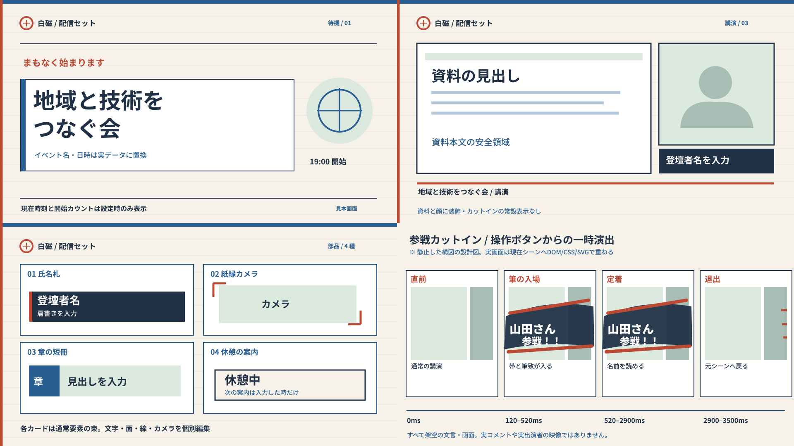

| 白磁：待機 | 白磁：資料＋カメラ講演 |
| --- | --- |
| 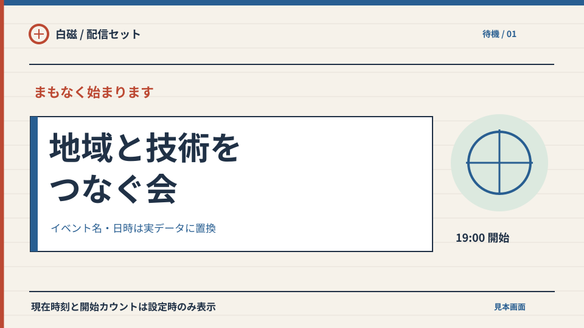 | 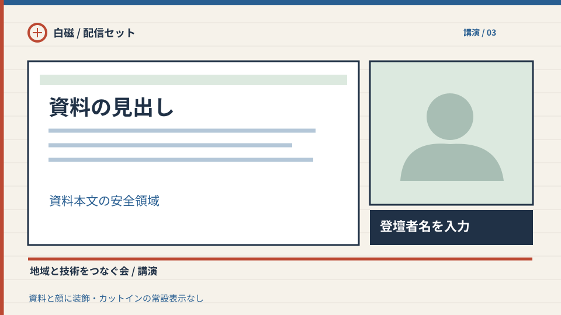 |
| 白磁：4種の編集できる部品 | ボタン演出：直前→入場→定着→退出 |
| 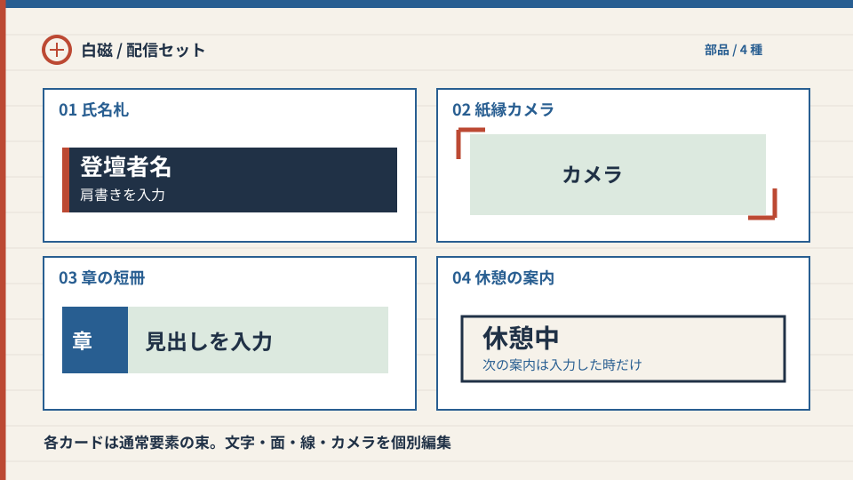 | 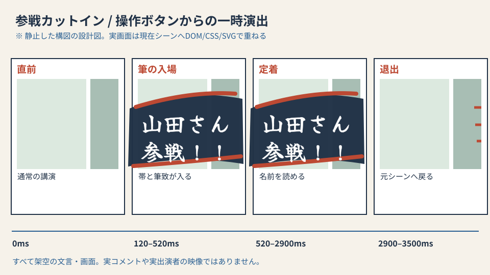 |

### 白磁（はくじ / Hakuji）：明るい配信画面

- 既定の新規作成は今までどおり。新しい固定 `templateId: "hakuji"` のみを `POST /api/live-sets` の許可リストに追加し、`baseLiveSetId` と同時指定は拒否。「新しい配信セット」→4枚から「白磁」を選ぶ→自分の7シーンを作る→部品を個別編集→イベント側でセットを選び出力を別タブで確認。既存セットへのテーマ上書き、グローバル light トグル、暗色セットや既定7シーンの変換はしない。シーンごとの編集・複製・Undo・自動保存の失敗表示は既定と同じ。操作ラベルは「白磁」「このスタイルで作成」「参戦演出」等を日本語先行とし、既存 i18n 辞書にキーと英語等の訳を置く。ユーザー入力した日本語は翻訳しない。
- 視覚: 温かな白 `#F6F2EA`、清潔な白面 `#FFFFFF`、本文/枠 `#203146`、青 `#285E91`、朱 `#BC4933`、薄青緑 `#DCE9DF`。明色面で本文・補助字は濃紺、青・朱は小面積のアクセント（小さな朱文字の可読性は実測）。暗色2種とは逆の明度と紙面の広い空白で一目で区別する。色の循環は顔や資料でなく独立した縁のみに制限。時刻・カウントダウンは白面に濃紺数字、設定なしなら隠す。LIVE OFF は文字も点も出さず ON 時のみ濃紺面＋白字の静止バッジ。チャットは白の不透明面＋濃紺字で人物/資料を遮らない（未投稿・OFF は透明）。サムネイルもこの対比を維持。
- 960×540 論理画面、外周48px、重要文字 x=52..908、y=54..480。講演は x=48..614/y=105..420 を資料、x=633..912/y=105..351 をカメラ、氏名は y=360..420、字幕・出所は下部の独立帯へ。資料の本文・顔へ装飾や名前を重ねない。720p/1080p および編集プレビューで同じ16:9スケール、名前帯最低22px 論理・本文最低16px 論理、長い日本語氏名は2行折返し／上限内省略（全文は編集欄）、長い題は最大2行＋編集で全文確認。狭いカメラには氏名を載せず独立帯を使う。資料が未選択・カメラが不許可でもプレースホルダーは「見本/未許可」とし偽映像を出さない。常設の一枚絵ではなく面・線・動的データを通常要素へ展開する。

| 白磁の新規セット7シーン | 独立した初期要素／任意の編集 |
| --- | --- |
| 待機 | 白いタイトル面＋動的イベント名/日時、右の輪の静止 motif。実時計・設定済みカウントダウンは任意。架空の時刻や未設定ロゴを本番に出さない。 |
| OP | 朱の短い開始線＋大きい動的イベント名を白面に配置。手入力の副題は空なら非表示。 |
| 講演 | 左資料＋右カメラ＋独立した濃紺の氏名札（初期の氏名/役割は空）＋イベント情報の細帯。 |
| 全画面資料 | 資料を中央の大面積へ。罫線・題名は資料外、チャットも初期では非表示。 |
| 全画面カメラ | 中央のカメラ＋下端の空欄可の氏名札。顔上は装飾なし。 |
| 休憩 | 白面に「休憩中」と動的イベント名、次の案内は手入力時のみ表示。未設定の再開時刻は出さない。 |
| ED | 線を控えめに減らした白面＋イベント名と「ありがとうございました」。自動 LIVE ON はしない。 |

| 「部品を追加 → 白磁」の4カード | 通常要素への展開・本当に編集できる値 |
| --- | --- |
| 「藍の氏名札」 | shape 濃紺面＋朱の縦線＋氏名 text＋役割 text（4層）。氏名/役割/色/線幅・位置を個別編集。空の氏名は出さない。 |
| 「紙縁カメラ」 | camera＋背面の薄青緑 shape＋対角2本の motif＋任意 caption text（5層）。camera fit/サイズと四隅/縁を別編集・削除。 |
| 「章の短冊」 | 青い番号面 shape＋任意番号 text＋薄青緑面 shape＋タイトル text（4層）。番号は手入力で、未入力時は番号面と番号字を削れる。 |
| 「休憩の案内」 | 白い枠面 shape＋見出し text＋任意案内 text＋朱の罫線 shape（4層）。再開時刻を自動推測しない。 |

カード1回の挿入を1 Undo とし、保存後は各レイヤーを個別に移動・再配色・削除できる。最大50要素の事前拒否、scene ID と element ID のユニーク化、既存 BGM 契約を継承する。静止プレビューの人型・文字・時間は**架空**。既存の時計/LIVE/chat 部品は白磁用配色で挿入可能とし、共有レンダラー・状態と認可ルールを別方式へ変えない。

### 運営の「参戦演出」— 現在シーンの上に一度だけ

入口: 当該イベントの配信コントロールに「参戦演出」を設け、`名前`（1–24文字、改行不可、制御文字不可）、`表示文`（1–40文字、初期は名前＋「 参戦！！」、任意編集可）を入力する。入力値の Unicode 正規化・空白整形・長さ制限はサーバとクライアントの双方で検証し、HTML/URL/任意CSS/画像は受け付けない。入力例「山田さん 参戦！！」は**架空の演出文**で実際の参加/参加者 API 状態を主張しない。配信へ自動反映しない独立した「見本を確認」プレビュー（運営側のみ）→「配信画面へ一度出す」トリガー。クリック後は「送信中」→返却された action ID と「受付済み」→配信画面タブが取得したとき「出力確認（画面タブ時刻）」、取得できなければ「出力未確認」、失敗なら「送信失敗・再試行」を表示する。受付＝実視聴者に描画済み、とは呼ばない。必要なら「取り消す」は現在の action ID のみ（消したい誤入力への安全操作）。手動「もう一度出す」は毎回**新しい ID** を発行し意図しないダブルクリックを防ぐ。送信ごとのクライアント生成冪等キーをイベントと staff に紐付け、応答を失った同一操作の再試行は同じ ID/結果を返す（新しい演出を望む場合は別の操作）。配信シーン・LIVE・コメント元は変えない。

視覚: 現在のシーンの上へ透過の独立 DOM/SVG レイヤーを乗せ、濃紺の斜め帯と朱の筆勢を**自作ベクター**で描く。日本語の筆文字は、実装時に SIL Open Font License 1.1 の [Yuji Syuku（OFL.txt、著作権 Yuji Project Authors）](https://github.com/google/fonts/tree/main/ofl/yujisyuku) を必要文字分 self-host し、ライセンス文書と著作権表示を同梱する案。SVG に文字アウトラインや第三者画像/ライセンス未確認フォントを埋め込まない。プレビュー図の文字はローカルの一般的な日本語ゴシックによる**代替見本**で筆フォントの実レンダリング保証ではない。フォント未ロード/不達時は `Noto Sans JP`, 日本語 system sans, sans-serif の太字＋自作の斜線・帯で意味を保ち、装飾のみで文字を隠さない。文字は CSS/DOM のテキストノードで表示、画像化や GIF 再生はしない。

ストーリーボードの目安（合計3.5秒）: 0–120ms 通常画面→120–520ms 帯が画面外から入り筆線が描かれる→520–2900ms 静止して氏名と文言が読める→2900–3500ms 帯ごと画面外へ抜け、元シーンが連続して残る。実寸720pでも文字約36px論理以上、長い入力は上限2行で文字サイズ下限を守り、端48pxに収める。カットイン中のみ資料/顔へ一瞬かかり得るが、半透明にせず資料と映像を劣化させない短い明示的演出とし、出力対象者へ運営がリハーサルで確認する。強いフラッシュ、点滅、音声、自動反復なし。`prefers-reduced-motion` またはフォント/アニメ失敗時は移動を無くした読みやすい静止帯を約3秒表示して確実に消す。タブ停止からの復帰では時刻を巻き戻して再生しない。

イベント単位の action 契約: eventId・サーバ生成の単調増加 `actionId`（イベント単位 sequence または衝突のないサーバ ID＋確定順）・正規化済み文言・`issuedAt`・`expiresAt=issuedAt+10s`・`dismissedAt?` をイベント状態に保存し、GET は最新の action だけ返す。発火 PATCH は当該イベントの**参加確定 staff**（admin バイパスなし）＋既存認証/CSRF を通過したときだけ、サーバ時刻で ID を新規発行する。公開 feed や外部 webhook は作らない。GET 1秒ポーリングの2画面タブは**各タブでそのイベントの既知 ID を追跡**し、新しい未失効 ID だけ1回出す。タブ初回読込は返却済み ID を既知にして**ページ reload では再生しない**（初回読込直後の発火はその後の新 ID なので表示）。イベント ID が変わったら追跡をリセットし、そのイベントの初回値を既知にして別イベントの action を絶対に出さない。閉じた/期限切れの ID は出さず、失敗/5秒超の GET 停滞では演出を消し stale を運営に知らせ、回復時の古い ID を再生しない。2出力タブはそれぞれ再生できるが、運営側 ack はタブごとの短命なタブ ID を付けた参加確定 staff 専用の event/action-scoped 受領 POST（演出を実際に DOM へ挿入したときだけ）で識別する。ポーリングする運営 UI は既知の画面タブごとに確認/未確認を表示し、1タブの ack を全タブ確認済みと表現しない。タブ ID はページ寿命だけ、ack は10秒程度で失効し録画/視聴者表示の保証には使わない。消去は同イベント・対象 ID のみ、同時に新しい演出を消さない。送信失敗は出力成功に見せず、再試行はユーザーが明示して行う。

`event_live_state` の scene/LIVE/chatSource/cut-in action は、上記の既存 read–merge–全列 UPDATE では競合で巻き戻る。**明示されたフィールドのみ原子的に PATCH**（action 発行は同イベント直列化・一意 ID 採番）し、シーン切替・LIVE OFF・chatSource OFF・演出発火の4並行操作が互いの値を復活/消去しない。どの古い暗色セットにも action 用の要素を保存せず、現在の出力シーンを覆う一時オーバーレイとして動く。イベント終了・権限喪失時は発火不可、画面は期限で消す。OBS 連携・参加検出・アラートエンジンは対象外。

### #562 のイベントコメント：投稿者のアイコンと名前

追加のイベントチャット表示型は、許可後の `ChatMember` にある `name` と `avatarUrl` を Nostr 投稿 `pubkey` に突き合わせる（`packages/shared/src/eventChat.ts`、`apps/server/src/db/repositories/eventChat.ts` は `event_chat_key`→`user.avatar_url` と `global_name ?? username`、`apps/web/src/components/chat/ChatMessageList.tsx` に既存の Avatar＋頭文字表示）。利用者アップロード/サーバが許可したプロフィール同期画像は `apps/server/src/lib/avatarStore.ts` の同一オリジン `/api/users/:id/avatar?v=...` に正規化される。リレー内の Nostr profile `picture`、投稿本文 URL、任意の外部投稿画像から**アイコンを作らない**。描画行は **丸い icon → 氏名 → 別列の「events lab」出所ラベル → 本文** の順。名前と出所を同一テキストに連結しない。アイコン無し・404/画像失敗・削除済み画像は本人名の安全な1文字頭文字（空名は無地シルエット）を色付き円の中へ出す。本人が画像を変えたら次の許可リスト更新の URL を利用。必要なら同一オリジン URL だけ表示する／外部由来値はサーバの既存取り込み経路で再検証する。第三者へ直接画像 GET しない。

既存の `chat-members` はイベントの参加確定・ブロック確認を通った場合のみ返り、`selectVisibleChatMessages` は許可 pubkey と非表示 ID と本文長を照合する。配信側でもイベント公開・確定日程・chatEnabled・参加確定メンバーを検証してから閲覧専用の一時鍵で relay を読む。許可リストが最新取得できない/期限超過したときは**アイコンだけでなく投稿行全体を消す**。5秒程度の同期遅れで非表示やブロックが伝わることは運営 UI に記載する。画面内 icon はクリック不可、本文は単なる text node（既存の一般チャット用のリンク/画像展開は持ち込まない）。no icon / load error 時にも出所と名前は残し、許可外の著者の架空フォールバック投稿は作らない。チャットはイベント設定 `off` が既定、切替/イベント変更/認可失効/GET stale ではバッファとアイコンをともにクリア。#564 の将来 YouTube 投稿者画像は別途公式 API の authorDetails・権利・第三者画像ポリシーを確認して設計し、旧文中の「個人アイコンは表示しない」は旧 #564 案の制限として扱う。#562 は YouTube の選択肢・接続・アイコンを一切公開しない。

### 独立した実装レビュー/受け入れゲート（本追補の実装許可ではない）

1. 新規の白磁だけが7シーンを持ち、各シーンを変更/保存/再読込して編集後の出力と比較。従来既定・灯り・輪郭と古い保存セットの JSON/画面差分がゼロ、ロゴなし・長い日本語氏名（24字）と題名（2行）、未選択資料/カメラ拒否、720p/1080p で文字切れ・資料/顔への常設重なりがないことを画面キャプチャで確認。
2. 白磁4カードを各1回挿入し文字・面・色・camera・線を別々に編集/削除→Undo/Redo→再読込し出力へ反映。50要素境界は追加前にエラー表示。時計の時刻とカウントダウン、LIVE OFF/ON とチャット行の明色面上のコントラストを実測し、reduced-motion でも数値更新。従来スタイルの clock/LIVE/chat の動作も回帰。
3. コントロールで架空名を入力し「見本を確認」では配信へ送られず、trigger の成功は ID/受付表示、2タブの受領状態を区別。演出中にシーンは変わらず、3.5秒後に画面が元どおりになる。過長/空/HTML/制御文字は拒否か無害な text、フォント失敗・reduced-motion・遅い描画でも静止帯の可読性と期限での消去を確認。明示 repeat は新 ID、二重押下は1回、dismiss は同 ID のみ。
4. 競合テストで scene 更新・LIVE OFF・chatSource OFF・cut-in 発火を2つの運営タブから重ね、最終値が相互上書きされないこと。期限切れ・出力画面 reload・別イベントへ切替・staff 権限取り消し・GET 失敗/5秒滞留では過去 action を再生せず演出も残さないこと。一般参加者・非確定スタッフ・admin バイパスの発火を拒否。
5. 実際の events lab 投稿について「許可済み著者の同一オリジン icon + name + 別の source」と空アイコン/壊れたURL時の頭文字/シルエットを検証。チャット OFF、非公開/無効イベント、未参加、ブロック、非表示、チャンネル変更、画像404、relayの偽 pubkey、更新失敗では行と画像を fail-closed。URLを投稿しても外部画像やリンクを展開しない。#562 UI/API が `youtube`/`combined` を許さないことをテスト。#564 の検証結果は別ゲート。

**オーナーに見てほしい選択（未承認）**: 白磁の配色/左右の資料・カメラ比率、カットインの朱・濃紺と静止時間、氏名と任意表示文を別欄にする入口。これらを含め実装・統合・配備は別途承認。ブラウザ実画面とフォント読込/明度は本設計図だけでは保証できない。
