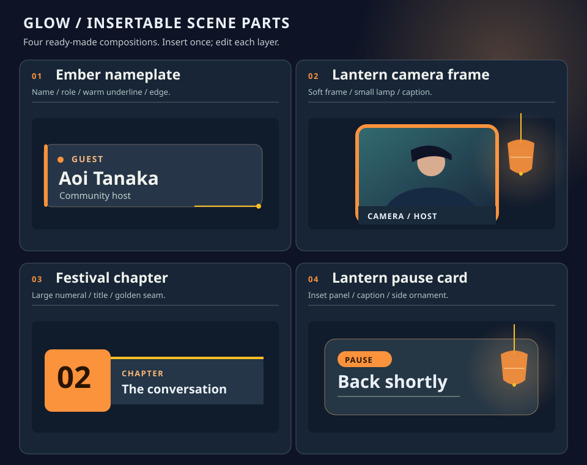
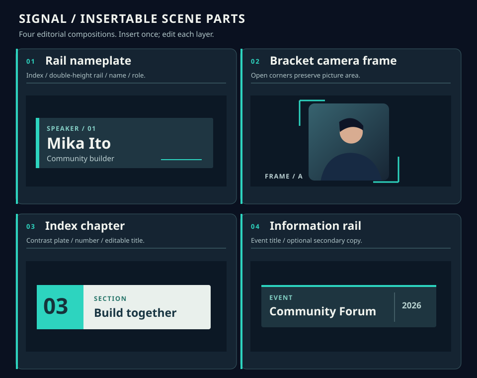

# #562 配信セットのビジュアル設計 — 提案（実装・配備前）

## 目的と判断

現在の配信セットは基本要素と一系統の既定7シーンで実用になるが、「最初から配信として見栄えがする完成画面」と「自分のイベントへ手早く着せ替えられる装飾」が足りない。優先する成果は**画面そのものの品質**。配信先との接続方式や配信URLの変更はこの案件に含めない。これはオーナーによる見た目の合意用設計であり、下の画像は動く画面のスクリーンショットではない。実装着手・統合・配備は別の承認を要する。

| 系統 | 待機（16:9） | 講演（16:9） |
| --- | --- | --- |
| **灯り / Glow**：集い・トーク。夜空、琥珀の灯、柔らかい額縁。温かさは装飾へ、操作色はティールへ限定。 |  |  |
| **輪郭 / Signal**：コミュニティ・技術講演。細い罫線、冷たい夜空、明快なタイポグラフィ。情報を先に読む。講演は**左カメラ・右資料**で灯りと異なる。 |  |  |

画像はすべてこの提案用に描いた**オリジナルのベクター説明図**（上の完成シーンは960×540）。人のシルエット、資料、イベント名、日時、角にある抽象的な**ロゴ見本**はダミーであり、実配信のスクリーンショットではない。外部写真・素材・商標・転載物を含まない。静的 SVG をそのままアップロードできるという意味ではない（現行画像経路の許可 MIME とは別）。**モックの予定表・時刻・登壇者名・講演番号・「ON AIR」等の状態表示は自動連携されない**。実連携するのは現行 `eventInfo` のタイトル・日時・参加者数・コミュニティのみ。これら以外の文字は手入力する任意の固定テキストで、誤った予定・配信状態を示すものは初期シーンに置かず、入力済みでも自動更新と誤認させない。Signal 待機の右カードは架空の番組表から実際に存在するイベントタイトル/日時を差し込む情報カードに変更した。

## 現状からの縦切り体験

- 現行: `/live-sets` から「新しい配信セット」で既定7シーンを複製するか、自分のセットを複製する。`/live-sets/:id/edit` で左のシーン一覧、中央のキャンバスと追加バー、右の要素設定を操作し自動保存。既定は待機・OP・スライド・スライド＋カメラ・カメラ・休憩・ED。イベントの配信コントロールで「デフォルト（ビルトイン）」または自分のセットを選び、シーンを切替え、別タブの完成画面をキャプチャする。現行の複製は**自分のセットだけ**。現行のエディタはカメラ/デッキ/イベント情報をプレースホルダーで表示し、配信画面は実データに置き換える。
- 提案入口: 一覧の「新しい配信セット」から**既定・灯り・輪郭**のビジュアルカード（待機＋講演のサムネイル）を選んで「このスタイルで作成」。既定カードは現在のシンプルな7シーンをそのまま残す。選択で新しい**自分の**セットを作成し、編集画面へ進む。既存セットの「このセットをベースに新規作成」は別の行動として残す。編集中のセットを別スタイルへ一括上書きしない。
- 編集: 最初から待機→オープニング→講演（スライド＋カメラ）→全画面資料→全画面カメラ→休憩→エンディングの流れが揃う。「部品を追加」から家族ごとの**完成部品カード**（下のシート）を一つ選び、その場で複数の通常要素を挿入する。登壇者名・章タイトルの見本文字を直し、必要なら色・線・モチーフ・枠/カメラ位置を個別編集する。挿入後は最初の主テキストを選択、続く編集はキャンバスで各要素を選択し右欄で変更する。『挿入カード』は操作の単位であって保存後のグループではない。各要素は独立に移動/複製/削除できる。色変更の影響は選択要素へ明示し、セット全体の色変更と混同しない。ドラッグ・整列の目安は16:9の安全領域で表示するが配信には出ない。自動保存の失敗は成功表示に化けず、再試行と未保存状態が分かる。既存の Undo/Redo・シーン複製・前後移動・要素の前後関係を維持する。
- リハーサル: 編集画面のカメラ・資料・イベント情報は引き続き**見本**と明示。実データは既存のイベント側コントロールで自分のセットを選択し、別タブの完成画面を確認する。配信中の編集反映は現行のポーリングに従い、反映タイミングを UI に説明する。スマホではリスト→プレビュー→設定を縦積みにし、配信画面そのものは16:9のまま縮小表示する。

## 視覚ルール（960×540 論理座標、出力16:9）

- **灯り**: 背景 `#0E1426`、面 `#1A2737`、本文 `#EAF0F7`、灯り `#FB923C`、操作の目印 `#2DD4BF`。一画面で橙は装飾・進行表示、ティールは操作・小さな強調に使い分ける。小提灯・柔らかい拡散光・細い対角線は端に寄せ、文字の背後を騒がせない。見出し 48–56、情報帯 18–22、補助 16px 以上を実出力の基準とする。細かいモックの識別子は放送必須情報にしない。
- **輪郭**: 背景 `#0A1120`、線 `#607C83`、大きな見出し `#F1F4EF`、強調 `#2DD4BF`、読み物パネル `#E9F0EC`＋濃色文字。太い余白・薄い方眼・非対称のパネルで整理し、ランタンや琥珀を混ぜない。待機はイベント名を主役に、講演は資料領域を主役に。イベントの運営画面は DESIGN.md の夜祭トーンを守り、配信シーンはその延長線上の**表現違い**とする。
- 書体は Plus Jakarta Sans（英数字）＋ Noto Sans JP（日本語）を候補とする。**現在 Plus Jakarta Sans は編集フォント選択肢にない**ため、実装時に共通フォント選択肢へ追加して編集/サムネイル/本番で同じ読み込み経路を使い、未ロード時は Noto Sans JP→sans-serif へ落とす。待機中に代替字幅で完成画面が撮られないよう、必要フォントの読み込み完了後のプレビュー/配信キャプチャで比較する。外部フォント不達でも読める代替を用意し、第三者の画像で代用しない。タイトル2行まで目安、長い日本語イベント名や登壇者名は実データで折返し・省略・改行案内を行い、隠れた全文は編集欄で確認できる。時計やイベント情報は文字列長が変わるためモックの行数を保証しない。名前帯にイベントタイトル全文を自動流入させない。
- 外周32px、情報枠に内側24–30px、主要コンテンツ間16px以上。配信テキストは端から原則48px以上、重要な顔・資料本文は約 x=64..896 / y=54..486 に収める。待機画面は上段に企画名、中央に主見出し、下段に実際のイベント日時。灯りの講演は**左の広い資料＋右の登壇者**、輪郭は**左の登壇者＋右の広い資料**で異なる視線誘導を作る。カメラの上へ資料の文字を重ねない。1枚のスクリーンショットを重ねるのではなく、資料・カメラ・動的文字・装飾を別部品にする。
- 動きはシーン切替の現行 400ms フェードを上限目安とし、飾りの常時点滅/強いパララックス/紙吹雪は採用しない。静止画キャプチャでも成立する。低モーション設定では切替アニメーションを抑える設計とする。小サイズのサムネイルでは詳細文字を省き、色とレイアウトで判別可能にする。

## 完成部品カタログ（両家族とも一枚ずつ個別挿入）

| 灯り：4つの装着例（部品シート） | 輪郭：4つの装着例（部品シート） |
| --- | --- |
|  |  |

**カタログの各カードは1回の挿入操作で完成した複数レイヤーを作り、個別に編集・削除できる（新しい保存グループ/リンク編集は不要）。** カードごとの構成は以下。モック上の人型/文字/ロゴは見本であり、完成部品に人物写真や偽の放送状態は含めない。色は家族の初期パレット、各レイヤーを選択したときの値を示す。

| 家族・挿入カード | 通常要素への展開（例） | 編集導線・使いどころ |
| --- | --- | --- |
| 灯り「琥珀の氏名帯」 | 角丸面＋左の橙レール＋小灯＋氏名/役割テキスト＋細い金ライン（6要素） | 氏名・役割を個別入力、面/線をそれぞれ再配色。講演・インタビューのカメラ下に置く。 |
| 灯り「提灯カメラ額」 | camera＋暖色の枠面（映像より背面）＋端の小提灯 motif＋任意キャプション（4要素） | 枠と映像は別に移動・調整しやすい位置に初期配置。装飾だけを削除しても映像は残る。 |
| 灯り「祭り章リボン」 | 数字/短いラベル/章タイトルの text＋橙と濃紺の面＋金ライン（6要素） | 章番号は**手入力**で自動進行しない。番号を削って文字だけでも使える。OPと幕間に挿入。 |
| 灯り「灯籠の休憩札」 | 枠面＋見出し/任意の次の案内 text＋提灯 motif＋小さな色チップ（5要素） | 待機・休憩・EDの余白に置く。再開時刻を初期表示せず、実際の案内だけ手入力。 |
| 輪郭「氏名レール」 | 濃色面＋縦ティールレール＋任意インデックス/氏名/役割 text＋細線（6要素） | インデックスは**手入力**、空なら省略。広めのカメラ下、対談にも使う。 |
| 輪郭「開放カメラ角」 | camera＋左上/右下の2つの角 motif＋任意の短いキャプション（4要素） | 角を動かす/消す操作で視認領域が変わる。映像に太いベゼルをかぶせない。 |
| 輪郭「番号付き章カード」 | 明色面＋番号面＋短い番号/章タイトル/種別 text（5要素） | 手入力の章番号を使わない場合は番号面と文字を個別削除。待機から講演への区切り。 |
| 輪郭「情報レール」 | 濃色面＋ティール線＋動的イベントタイトル＋任意の副文 text＋区切り線（5要素） | タイトルは `eventInfo.title`。副文は未入力で非表示（年・時刻・配信状態を勝手に補わない）。待機、全画面資料の隅に。 |

カメラを含むカードは既存 `camera` のフィット/角丸に従う。部品を個別に挿入した結果が各シーン50要素を超える場合は事前に追加を止めて理由を表示する。プリセット挿入の Undo は1回で全追加を元に戻せるようにし、既存の複製/前後移動/削除はレイヤー単位。操作の入口は「部品を追加 → 家族別サムネイル → 挿入 → キャンバスで部品レイヤーを選択 → 右欄で内容・色・位置を編集」。他家族の部品も個別選択可能だが、最初のテンプレートだけ家族で絞る。

**ロゴ**: 完成フレームの左上に見える抽象マークは**任意画像枠の位置を示す見本**であり、ブランド画像を自動提供しない。灯りは左上 x=52..80、輪郭は左上 x=64..89 の小さな枠、対応するイベント名/文字見出しはその右。画像を挿入した人だけロゴを表示し、未設定なら枠を出さず文字を左端へ寄せる。アップロードは既存画像経路、アスペクト比は contain、容量/背景違いでもロゴが主役の文字を隠さない。ロゴの有無・差替えはシーン間で実際に目視確認する。

## 七つのシーンを「完成セット」にする処理

| シーン | 灯り / Glow | 輪郭 / Signal |
| --- | --- | --- |
| 待機 | モックの夜空・灯り2点＋左の大きなタイトルカード＋**実際の**イベント日時。空のロゴ枠は非表示。 | モックの大きなイベント名＋右の動的タイトル/日時カード。任意の番組表は**初期では出さない**。 |
| OP | 暖色グラデの幕開け、大きなイベント名、下端の細い灯りライン/モチーフ。架空の開始カウントなし。 | 左レールを伸ばしたタイトルパネル、右に短い装飾線と動的イベント名/日時。章インデックスの架空数値なし。 |
| 講演 | 左の明るい資料面＋右カメラ、琥珀の氏名帯、下端にイベント名/任意の講演題。 | **左のカメラ＋右の明色資料面**、氏名レール、細い下部情報帯。両者は反転だけではなく面積比・角処理・配色を変える。 |
| 全画面資料 | 余計な情報を差し込まず deck を大きく表示。灯りの上下細線と任意の小イベントラベルは資料にかぶせない。 | deck を大きく表示し、細い周辺罫線と小さいイベント名レール。映像の縁の安全余白を守る。 |
| 全画面カメラ | camera 主体、名前帯と端の1灯だけ、顔には模様を置かない。 | camera 主体、開放角フレーム＋氏名レール。映像がないときは既存の未許可表示。 |
| 休憩 | 灯籠の休憩札＋低コントラストの夜空、再開時刻は手入力した場合のみ表示。 | 薄い格子の背景＋余白を取った『休憩中』カード、次の案内は任意入力。自動の進行状態なし。 |
| ED | 同じ灯りを減らした静かな夜空、イベント名と御礼、下端の光ライン。 | 左レールを閉じる終幕パネル、イベント名と御礼、背景の方眼を控えめに。 |

各スタイル7枚を新規セットへ複製する。シーンの削除・複製・順序変更は既存どおり。BGM は既存の「維持/停止/選択」を継承し、テンプレートはライセンス未確定の曲を自動再生しない。

**必要な実装境界（提案、未実装）**: `LiveSetContent` は現在 `text/image/camera/deck/eventInfo`、要素上限50・シーン上限50。配信画面は `LiveSceneStage`、編集キャンバスは `LiveElementContent` を共有する。実装時は `shape`（矩形/円/線、塗り/枠線/角丸/不透明度）と `motif`（安全な定義済み形状ID: 小提灯/角ブラケット/方眼など、色/不透明度）を要素の追加候補とする。**部品カードのデータはこの通常要素の並びと初期配置**であり、挿入時に一意のIDを割り振り、選択した各レイヤーを保存して同じルールで拡縮する。テキスト・画像・映像を大きな画像1枚に焼き込む方式は**非採用**（編集不能・実データ欠落）。新種とテンプレの静的データは shared の schema と web の編集/描画・要素欄で対応し、固定テンプレは版付きの同梱定義として作成時だけ展開、既存のセットに後から見た目を注入しない。情報帯は shape + text の組合せとし、不要な保存グループ編集システムは増やさない。初期シーンと挿入先は各50要素以内で確認する。

**画像と権利**: 追加の見本アートは自作の SVG 原画から、配信で使う同梱 raster (透過 PNG/WebP) へ変換し、UI 上でプリセットとして挿入するなら同一オリジン URL を保持する。既存の利用者アップロードは許可形式・6MB 上限・所有者チェックの画像ルートを使う。ユーザー任意画像の著作権はユーザーに確認を促すが、外部素材を既定セットへ同梱しない。画像URLを編集できる既存機能を拡張して外部スクリプト・HTMLを実行させない。SVG の任意アップロード許可はこの設計に含めない。静的な提案 SVG はプロダクトに埋め込むスクリプトではない。

## API・認可・互換性

- 新規作成のみ `POST /api/live-sets` に任意 `templateId: "glow" | "signal"` を追加する案。`templateId` なし＝現行既定、`baseLiveSetId` と同時指定は拒否する。サーバー固定リスト以外を拒否し、クライアントが任意 content を「組込テンプレ」と称して送れないようにする。既存の複製は所有者チェックを維持。`GET /mine`, `GET /:id`, `PATCH /:id` の認証・オーナー判定を変えず、イベントへのセット選択・既定 ID・画面の取得権限も変更しない。配信URL新設や公開テンプレ共有 API は不要。
- 既存 JSON に新要素を追加する前方互換の拡張とする。昔のセットと仮想既定7シーンは**自動変更しない**。既存要素の座標、BGM の undefined/null/trackId、配信の activeSceneId を維持する。新しいセットは作成時に固定 ID としてコピーし、編集や複製で ID 重複・画像 URL の他人のセットへの参照が生じないように扱う（所有権がある元セットのみ複製可。ユーザーアップロード画像を複製する時の実体参照・削除方針を実装前に検証）。古いブラウザタブで新要素を含む content を再保存すると未知フィールドを落とす可能性があるので、実装時は旧クライアントの編集停止/リロード通知等で保護してからリリースする。DB migration は現在の content JSON 保存が成立する限り不要、コード検証で判断する。
- プレビューと本番は**同じシーン要素レンダラー**が必須。現行エディタは独自配置、サムネイル/配信は `LiveSceneStage` なので、新要素の描画・重ね順・折返し・拡縮を三者で揃える。見本イベントデータと実イベントデータの差、未許可カメラ、未選択資料、画像未取得を明示する。ポーリングによる更新の見え方は収録前の実機確認で検証する。

## 受け入れ（後続実装の合格条件）

1. 新規作成で3カードの違いが小さいサムネイルでも判別でき、「灯り」「輪郭」を選ぶと**各7シーンが編集可能な自分のセット**として作成される。無選択の従来作成と他人所有セットの複製拒否は変わらない。
2. 待機と講演に加えて**OP・全画面資料・全画面カメラ・休憩・ED**を両家族とも実画面でキャプチャし、上の7シーン表の処理と照合する。各シーンを実際に1080p/720p、PCの960×540プレビュー、縮小したスマホプレビューで比較し、重要なタイトルと登壇者帯が切れず、顔と資料の重なりがなく、文字が映像上で読めること。全画面資料は資料本文を装飾が隠さないこと。長い日本語タイトル・英語タイトル・未登録/差替え済みロゴ・カメラ拒否・資料未選択・フォント読み込み失敗も確認する。見本の人物画を実人物が表示されると誤認させない。
3. 両家族の**4つずつの完成部品を一つずつ挿入**し、見本文字と色/線を変更、カメラ枠の装飾だけを削除、異なるシーンへ再挿入、Undo→Redo、保存→再読込→配信画面へ反映することを確認する。挿入された各レイヤーが個別選択・移動・複製・削除でき、何が編集できるか分かる。単純なフラット画像1枚では不可。50要素を超える場合は黙って切り捨てない。
4. 編集のサムネイルと本番が同じ重ね順・書体・色・角丸・画像を示し、動的タイトル/日付/カメラ/スライドだけは意図した実データに入れ替わる。**予定がモックと違うイベント**で、架空の番組表・章番号・ON AIR 等の自動生成が無いこと、手入力の固定文字は固定と分かることを確認する。旧セット/ビルトイン既定の再読込・シーン切替・BGMは回帰しない。
5. 権限のないユーザーが他人のテンプレ元・セット内容・画像登録へアクセスできない。古い編集タブで新要素が失われないことと、アップロード画像を持つセットの複製/削除の結果を確認する。

## オーナー合意が必要な選択

- 主力の初期スタイルを「灯り」「輪郭」のどちらにするか（案: 既定はこれまで通り、両方を選択肢に追加）。実際の画面を見た上で色・余白・文字の重みを確定する。
- 登壇者名を初期値の固定テキストのままとするか、イベント側に登壇者情報の正式な紐付けが必要か。後者は本件の新たなデータ範囲なので別途決定する。
- 複製時の**元セットの画像実体参照と削除寿命**は現状コードとデータで検証して決定し、共有実体のリンク切れを起こさない。これを確認せず画像付きテンプレの実装を開始しない。
